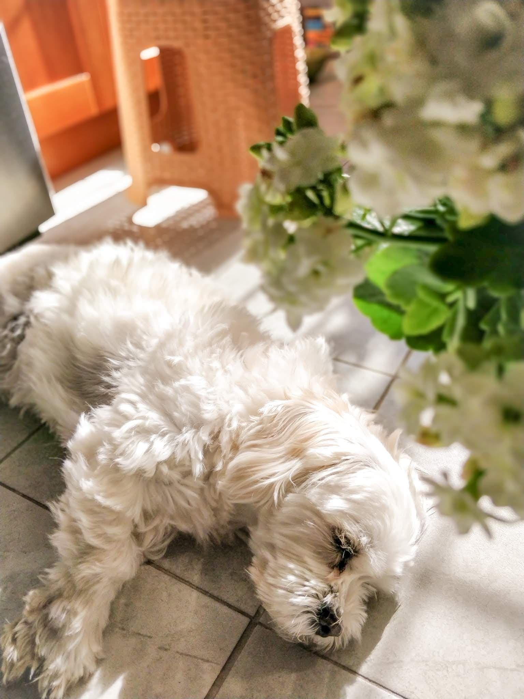
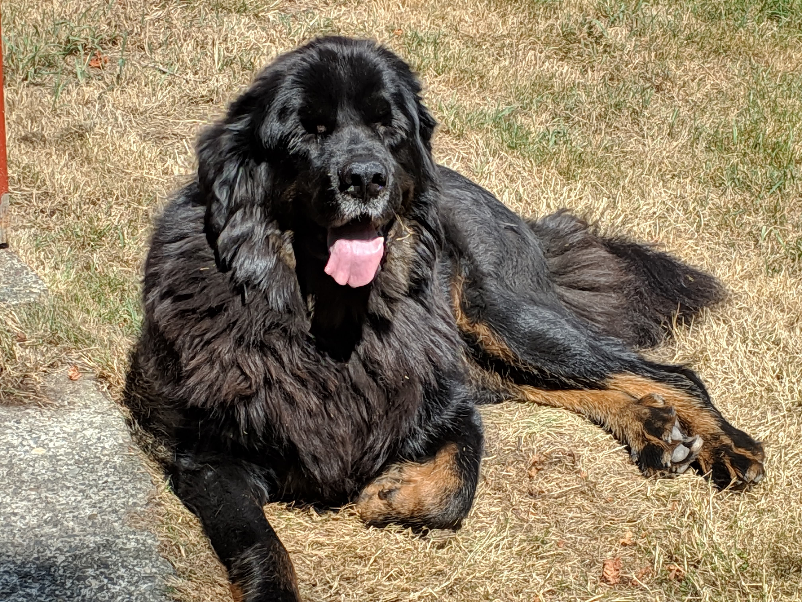
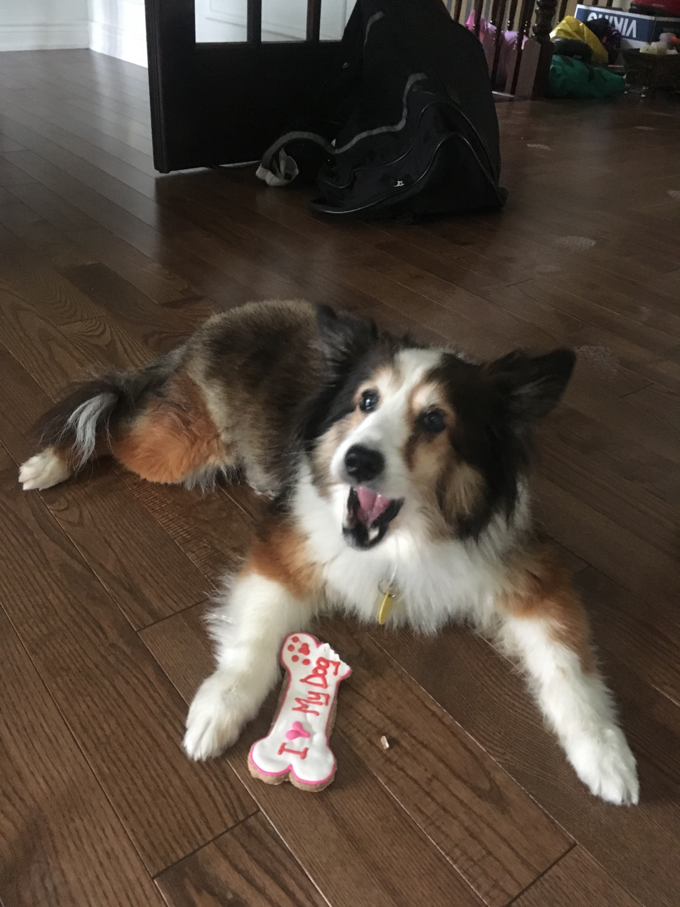
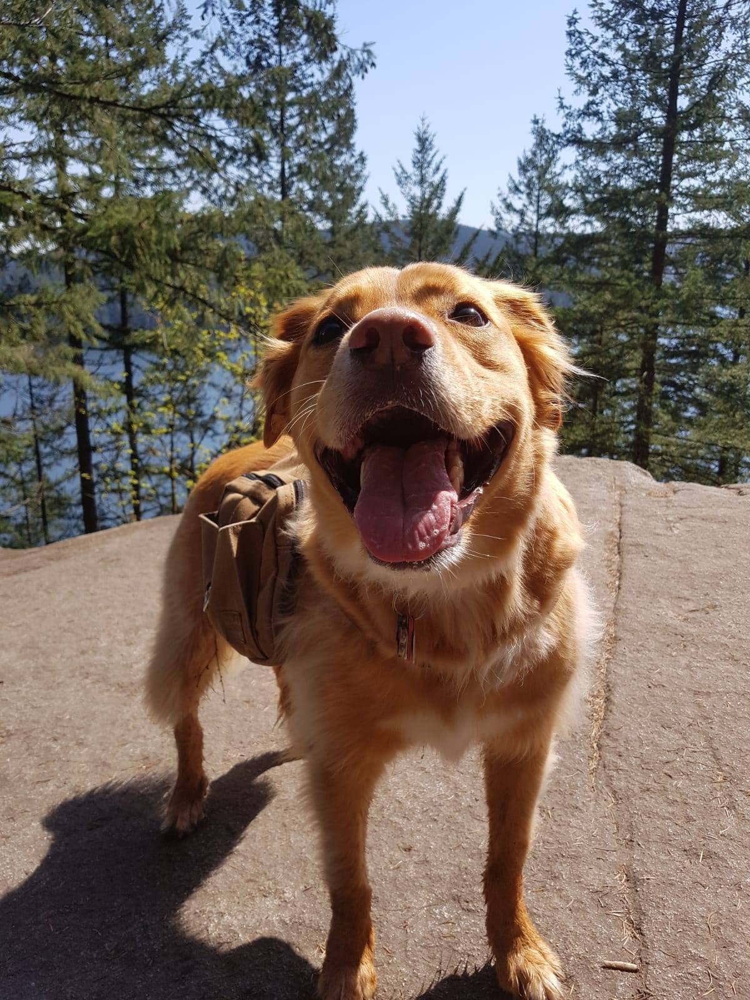

```{r setup, include=FALSE}
knitr::opts_chunk$set(echo = TRUE)
```

<!-- To demonstrate that I've understood the seminar material regarding markdown features, I've compiled a simple summary of dogs I know. Markdown features used include: -->

<!-- * Headers -->
<!-- * Lists -->
<!-- * Links -->
<!-- * Images -->

# Meet... the Dogs!

```{r load packages, message = FALSE, warning = FALSE, echo = FALSE}
library(tidyverse)
library(knitr)
library(ggrepel)
```

<!-- Read in the data: -->
```{r load csv, echo = FALSE}
dogs <- read_csv("dogs/dogs.csv", 
                 col_types = cols(col_character(),
                                  col_character(), 
                                  col_factor(),
                                  col_factor(),
                                  col_integer()))
dogs$Size <- fct_relevel(dogs$Size, "small")

```

<!-- What's in this data frame? -->
```{r show data, echo = FALSE}
kable(dogs)
```

## Dumpling {.tabset .tabset-fade}


```{r Dumpling, echo = FALSE}
dogs %>%
  filter(Name == "Dumpling") %>%
  kable()
```

### Likes
* playing fetch
* swimming
* snow
* car rides with the windows down

### Dislikes
* baths
* grooming
* rain
* puddles
* liver (but liver-flavoured treats are ok)
* hula hoops

### Favourite Foods
1. Cheesecake
1. Any other cake
1. Beef
1. Peanut butter
1. Bananas

## {.toc-ignore}

*Fun fact*: She loves playing with the laser pointer, like a cat!

**Instagram**: [\@dumpling_thebc](http://www.instagram.com/dumpling_thebc)

## Cupcake {.tabset .tabset-fade}

 <br/><br/>


```{r Cupcake, echo = FALSE}
dogs %>%
  filter(Name == "Cupcake") %>%
  kable()
```

### Likes
* human food
* baths
* apples
* snow
* guarding the house

### Dislikes
* rain
* water
* strangers
* toys
* the vacuum

### Favourite Foods
1. Cesar dog food
1. Bacon flavour dog treats
1. Apples
1. Chicken
1. Peanut butter
1. Mango
1. _Cheap_ dog treats

## {.toc-ignore}

_Fun fact_: She loves wet dog food but it makes her poop wet, so a bit of wet food is mixed into her dry food.

## Bella {.tabset .tabset-fade}


```{r Bella, echo = FALSE}
dogs %>%
  filter(Name == "Bella") %>%
  kable()
```

### Likes
* cheese
* peanut butter
* banana
* rabbit poop
* chasing after rabbits

### Dislikes
* celeri
* carrots

### Favourite Foods
1. Cheese
1. Peanut butter (and banana)
1. Cucumber
1. Whatever she can get

## {.toc-ignore}

_Fun fact_: XXX

## Nova {.tabset .tabset-fade}

 <br/> <br/>


```{r Nova, echo = FALSE}
dogs %>%
  filter(Name == "Nova") %>%
  kable()
```

### Likes
* snow
* napping
* soccer balls
* eating sticks
* cleaning ears

### Dislikes
* peanut butter (thinks there's medicine in it)
* that one specific neighbour
* baths
* apples
* strangers (nervous)

### Favourite Foods
1. Chicken
1. Ice cream (lactose intolerant but will beg for it)
1. Yams
1. Dentastix
1. Rice
1. Oranges

## {.toc-ignore}

*Fun fact*: Honestly very catlike-- will walk away from you if you sit too close but will be upset if not in the same room.

## Peas {.tabset .tabset-fade}


```{r Peas, echo = FALSE}
dogs %>%
  filter(Name == "Peas") %>%
  kable()
```

### Likes
* bread
* hiking
* chest rubs

### Dislikes
* oranges
* when you touch his feet
* when you blow on his face

### Favourite Foods
1. Bread
1. Chicken
1. Duck
1. Lamb
1. Beef
1. Eggs
1. Rice
1. Potato
1. Sweet potato
1. Pumpkin
1. Broccoli
1. Spinach
1. Lettuce

## {.toc-ignore}

_Fun fact_: His kisses are essentially a wet nose bumping into your face.

__Instagram__: [\@peasthegreatberner](http://www.instagram.com/peasthegreatberner)

## Delilah {.tabset .tabset-fade}

 <br/><br/>


```{r Delilah, echo = FALSE}
dogs %>%
  filter(Name == "Delilah") %>%
  kable()
```

### Likes
* lounging and napping
* meeting new people
* being pet
* nice ear massages

### Dislikes
* when her family swims in any body of water (especially the swimming pool)
* her niece, 9-month-old Harley the beagle

### Favourite Foods
1. Salmon
1. Peanut butter
1. Cod jerkey

## {.toc-ignore}

_Fun fact_: Delilah tells off Harley for being too high strung.

## Dumbo {.tabset .tabset-fade}


```{r Dumbo, echo = FALSE}
dogs %>%
  filter(Name == "Dumbo") %>%
  kable()
```

### Likes
* attention
* cuddling

### Dislikes
* toys
* darkness
* being left alone at night
* Maya

### Favourite Foods
1. Wet dog food
1. Chicken breast
1. Watermelon
1. Apples
1. Bananas

## {.toc-ignore}

_Fun fact_: He bites at night and nobody (not even the vet) knows why.

## Maya {.tabset .tabset-fade}


```{r Maya, echo = FALSE}
dogs %>%
  filter(Name == "Maya") %>%
  kable()
```

### Likes
* any food
* going for walks
* napping
* being held

### Dislikes
* walking at home
* sleeping alone
* her own bed
* toys
* Dumbo

### Favourite Foods
1. Wet dog food
1. Any food

## {.toc-ignore}

_Fun fact_: She will follow you wherever you go at home.

## Toby {.tabset .tabset-fade}

<!--  -->

```{r Toby, echo = FALSE}
dogs %>%
  filter(Name == "Toby") %>%
  kable()
```

### Likes
* chest scratches
* pats
* window watching / scenery

### Dislikes
* his pants
* going out in crappy weather
* baths

### Favourite Foods
1. Salmon
1. Meat
1. Ice cream
1. Whimzees

## {.toc-ignore}

_Fun fact_: he had a mop phase (see photo proof)!

## Sonny {.tabset .tabset-fade}

<!--  -->

```{r Sonny, echo = FALSE}
dogs %>%
  filter(Name == "Toby") %>%
  kable()
```

### Likes
* soft blankets and pillows
* swimming

### Dislikes
* vacuum
* fireworks
* white fluffy dogs
* the mailman

### Favourite Foods
1. Human food
1. Salmon
1. Meat
1. Ice cream

## {.toc-ignore}

_Fun fact_: He's a rescue from Texas!

## Cookie {.tabset .tabset-fade}

<!--  -->

```{r Cookie, echo = FALSE}
dogs %>%
  filter(Name == "Cookie") %>%
  kable()
```

### Likes
* running
* Rachel

### Dislikes
* people touching his paws

### Favourite Foods
1. Meat

## {.toc-ignore}

_Fun fact_: He's a rescue from Taiwan!

## Luna {.tabset .tabset-fade}

<!--  -->

```{r Luna, echo = FALSE}
dogs %>%
  filter(Name == "Luna") %>%
  kable()
```

### Likes
* attention

### Dislikes
* being leashed
* the mailman

### Favourite Foods
1. Meat
1. Fruit
1. Ice cream

## {.toc-ignore}

_Fun fact_: She has a surprisingly deep bark.

## Buddy {.tabset .tabset-fade}


```{r Buddy, echo = FALSE}
dogs %>%
  filter(Name == "Buddy") %>%
  kable()
```

### Likes
* TREATS

### Dislikes
* brushing his teeth
* walking when he doesn't want to 
* rain
* the vet
* starfruit

### Favourite Foods
1. Meat
1. Anything

## {.toc-ignore}

_Fun fact_: He will respond to "TREATS" more than his own name.

**Instagram**: [\@buddychaoder](http://www.instagram.com/buddychaoder)


# Characteristics
```{r age}
dogs %>%
  ggplot(aes(x=Size, y=Age, colour = Sex)) +
  geom_jitter(position = position_jitter(width = 0.3, 
                                         seed = 3)) + 
  geom_text_repel(aes(label=Name), 
                  position = position_jitter(width = 0.3, 
                                             seed = 3), 
                  show.legend = FALSE, 
                  colour = "black") +
  labs(y = "Age (years)",
       x = "Size",
       title = "Dog Characteristics") +
  theme_bw() +
  theme(text = element_text(size = 18),
        legend.title.align = 0.5)
```

