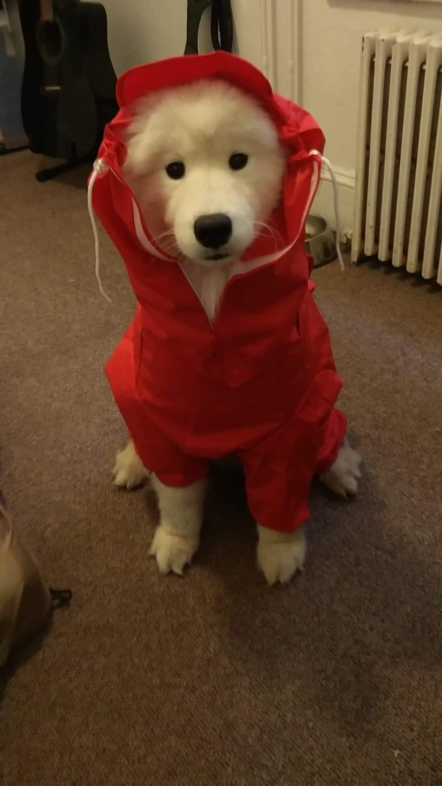

```{r setup, include=FALSE}
knitr::opts_chunk$set(echo = TRUE)
```

<style type="text/css">
body, td {
   font-size: 18px;
}
code.r{
  font-size: 18px;
}
pre {
  font-size: 18px
}
</style>

```{r load packages, message = FALSE, warning = FALSE, echo = FALSE}
library(tidyverse)
library(knitr)
library(ggrepel)
```

# Meet... the Dogs!

<center></center>

<!-- Read in the data: -->
```{r load csv, echo = FALSE}
dogs <- read_csv("dogs/dogs.csv", 
                 col_types = cols(col_character(),
                                  col_character(), 
                                  col_factor(),
                                  col_factor(),
                                  col_double()))
dogs$Size <- fct_relevel(dogs$Size, "small")

```

<!-- What's in this data frame? -->
```{r show data, echo = FALSE}
kable(dogs)
```

## Dumpling {.tabset .tabset-fade}


```{r Dumpling, echo = FALSE}
dogs %>%
  filter(Name == "Dumpling") %>%
  kable()
```

### Likes
* playing fetch
* swimming
* snow
* car rides with the windows down

### Dislikes
* baths
* grooming
* rain
* puddles
* liver (but liver-flavoured treats are ok)
* hula hoops

### Favourite Foods
1. Cheesecake
1. Any other cake
1. Beef
1. Peanut butter
1. Bananas

## {.toc-ignore}

#### **Fun Fact**: She loves playing with the laser pointer, like a cat!

<div align="right"><h4>&nbsp;[dumpling_thebc](http://www.instagram.com/dumpling_thebc) </h4></div>

***

## Cupcake {.tabset .tabset-fade}

 <br/><br/>


```{r Cupcake, echo = FALSE}
dogs %>%
  filter(Name == "Cupcake") %>%
  kable()
```

### Likes
* human food
* baths
* apples
* snow
* guarding the house

### Dislikes
* rain
* water
* strangers
* toys
* the vacuum
* *cheap* dog treats

### Favourite Foods
1. Cesar dog food
1. Bacon flavour dog treats
1. Apples
1. Chicken
1. Peanut butter
1. Mango

## {.toc-ignore}

#### **Fun Fact**: She loves wet dog food but it makes her poop wet, so a bit of wet food is mixed into her dry food.

***

## Bella {.tabset .tabset-fade}


```{r Bella, echo = FALSE}
dogs %>%
  filter(Name == "Bella") %>%
  kable()
```

### Likes
* cheese
* peanut butter
* banana
* rabbit poop
* chasing after rabbits

### Dislikes
* celeri
* carrots

### Favourite Foods
1. Cheese
1. Peanut butter (and banana)
1. Cucumber
1. Whatever she can get

## {.toc-ignore}

#### **Fun Fact**: She loves to have her butt scratched.

***

## Nova {.tabset .tabset-fade}

 <br/> <br/>


```{r Nova, echo = FALSE}
dogs %>%
  filter(Name == "Nova") %>%
  kable()
```

### Likes
* snow
* napping
* soccer balls
* eating sticks
* cleaning ears

### Dislikes
* peanut butter (thinks there's medicine in it)
* that one specific neighbour
* baths
* apples
* strangers (nervous)

### Favourite Foods
1. Chicken
1. Ice cream (lactose intolerant but will beg for it)
1. Yams
1. Dentastix
1. Rice
1. Oranges

## {.toc-ignore}

#### **Fun Fact**: Honestly very catlike-- will walk away from you if you sit too close but will be upset if not in the same room.

***

## Peas {.tabset .tabset-fade}


```{r Peas, echo = FALSE}
dogs %>%
  filter(Name == "Peas") %>%
  kable()
```

### Likes
* bread
* hiking
* chest rubs

### Dislikes
* oranges
* when you touch his feet
* when you blow on his face

### Favourite Foods
1. Bread
1. Chicken
1. Duck
1. Lamb
1. Beef
1. Eggs
1. Rice
1. Potato
1. Sweet potato
1. Pumpkin
1. Broccoli
1. Spinach
1. Lettuce

## {.toc-ignore}

#### **Fun Fact**: His kisses are essentially a wet nose bumping into your face.

<div align="right"><h4>&nbsp;[peasthegreatberner](http://www.instagram.com/peasthegreatberner)</h4></div>

***

## Delilah {.tabset .tabset-fade}

 <br/><br/>


```{r Delilah, echo = FALSE}
dogs %>%
  filter(Name == "Delilah") %>%
  kable()
```

### Likes
* lounging and napping
* meeting new people
* being pet
* nice ear massages

### Dislikes
* when her family swims in any body of water (especially the swimming pool)
* her niece, 9-month-old Harley the beagle

### Favourite Foods
1. Salmon
1. Peanut butter
1. Cod jerkey

## {.toc-ignore}

#### **Fun Fact**: Delilah tells off Harley for being too high strung.

***

## Dumbo {.tabset .tabset-fade}


```{r Dumbo, echo = FALSE}
dogs %>%
  filter(Name == "Dumbo") %>%
  kable()
```

### Likes
* attention
* cuddling

### Dislikes
* toys
* darkness
* being left alone at night
* Maya

### Favourite Foods
1. Wet dog food
1. Chicken breast
1. Watermelon
1. Apples
1. Bananas

## {.toc-ignore}

#### **Fun Fact**: He bites at night and nobody (not even the vet) knows why.

***

## Maya {.tabset .tabset-fade}


```{r Maya, echo = FALSE}
dogs %>%
  filter(Name == "Maya", `Age (years)` == 5) %>%
  kable()
```

### Likes
* any food
* going for walks
* napping
* being held

### Dislikes
* walking at home
* sleeping alone
* her own bed
* toys
* Dumbo

### Favourite Foods
1. Wet dog food
1. Any food

## {.toc-ignore}

#### **Fun Fact**: She will follow you wherever you go at home.

***

## Toby {.tabset .tabset-fade}


```{r Toby, echo = FALSE}
dogs %>%
  filter(Name == "Toby") %>%
  kable()
```

### Likes
* chest scratches
* pats
* window watching / scenery

### Dislikes
* his pants
* going out in crappy weather
* baths

### Favourite Foods
1. Salmon
1. Meat
1. Ice cream
1. Whimzees

## {.toc-ignore}

#### **Fun Fact**: he had a mop phase!

 <br/><br/>


***

## Sonny {.tabset .tabset-fade}


```{r Sonny, echo = FALSE}
dogs %>%
  filter(Name == "Sonny") %>%
  kable()
```

### Likes
* soft blankets and pillows
* swimming

### Dislikes
* vacuum
* fireworks
* white fluffy dogs
* the mailman

### Favourite Foods
1. Human food
1. Salmon
1. Meat
1. Ice cream

## {.toc-ignore}

#### **Fun Fact**: He's a rescue from Texas!

***

## Cookie {.tabset .tabset-fade}


```{r Cookie, echo = FALSE}
dogs %>%
  filter(Name == "Cookie") %>%
  kable()
```

### Likes
* running
* Rachel

### Dislikes
* people touching his paws

### Favourite Foods
1. Meat

## {.toc-ignore}

#### **Fun Fact**: He's a rescue from Taiwan!

***

## Luna {.tabset .tabset-fade}


```{r Luna, echo = FALSE}
dogs %>%
  filter(Name == "Luna") %>%
  kable()
```

### Likes
* attention

### Dislikes
* being leashed
* the mailman

### Favourite Foods
1. Meat
1. Fruit
1. Ice cream

## {.toc-ignore}

#### **Fun Fact**: She has a surprisingly deep bark.

***

## Buddy {.tabset .tabset-fade}


```{r Buddy, echo = FALSE}
dogs %>%
  filter(Name == "Buddy") %>%
  kable()
```

### Likes
* TREATS

### Dislikes
* brushing his teeth
* walking when he doesn't want to 
* rain
* the vet
* starfruit

### Favourite Foods
1. Meat
1. Anything

## {.toc-ignore}

#### **Fun Fact**: He will respond to "TREATS" more than his own name.

<div align="right"><h4>&nbsp;[buddychaoder](http://www.instagram.com/buddychaoder)</h4></divr>

***

## Maya {.tabset .tabset-fade}


```{r Maya-2, echo = FALSE}
dogs %>%
  filter(Name == "Maya", `Age (years)` == 13) %>%
  kable()
```


### Likes
* walks
* grandma
* drives

### Dislikes
* lettuce
* other dogs (scared)

### Favourite Foods
1. Chicken
1. Oranges
1. Frozen veggies
1. Bananas
1. Apples

## {.toc-ignore}

#### **Fun Fact**: She got a box (accidentally) for Christmas and loves to sleep in it!


***

## 小點 (Dots) {.tabset .tabset-fade}


```{r Dots, echo = FALSE}
dogs %>%
  filter(Name == "小點 (Dots)") %>%
  kable()
```

### Likes
* walks
* catch (especially with balls)
* that game where you move your hand under the blanket and she goes crazy for it
* food, especially treats like milk bones
* human food

### Dislikes
* bikes
* runners
* skateboarders
* fireworks
* crows
* cutting nails
* baths (maybe water in general)

### Favourite Foods
1. Beef/Salmon
1. Pork/Chicken
1. Treats
1. Whatever we're eating
1. Fruits and veggies (carrots, watermelon, papaya, cantaloupe, durian)

## {.toc-ignore}

#### **Fun Fact**: She's the oldest in her litter of 7.

***

## Teddy {.tabset .tabset-fade}


```{r Teddy, echo = FALSE}
dogs %>%
  filter(Name == "Teddy") %>%
  kable()
```

### Likes
* ATTENTION
* belly rubs
* to be chased / play
* pets

### Dislikes
* no attention
* being ignored/not let in the same room

### Favourite Foods
1. TREATS
1. Kibble

## {.toc-ignore}

#### **Fun Fact**: His back right knee is too small and his leg is slightly crooked so he limps-- it doesn't hurt for him though!

***

## Darcy {.tabset .tabset-fade}


```{r Darcy, echo = FALSE}
dogs %>%
  filter(Name == "Darcy") %>%
  kable()
```

### Likes
* eating/playing in snow
* playing fetch
* cuddling with her humans

### Dislikes
* vacuums
* strangers (she's a scaredy cat)

### Favourite Foods
1. Salmon / Lamb / Duck / Blueberries
1. Beef / Apples
1. Chicken

## {.toc-ignore}

#### **Fun Fact**: Darcy sings along to music all the time!!!

***

## Theo {.tabset .tabset-ignore}


```{r Theo, echo = FALSE}
dogs %>%
  filter(Name == "Theo") %>%
  kable()
```

### Likes
* sleeping
* going in and out a lot
* licking carpets
* greeting people when they come in
* car rides
* playing in water

### Dislikes
* walks that are longer than a couple of blocks
* dogs that won't leave him alone when he's tired
* getting left behind when people leave
* actually getting into the water in the first place

### Favourite Foods
1. Liver
1. Raw egg
1. Popcorn
1. Kibble

## {.toc-ignore}

#### **Fun Fact**: Theo is from Arizona.

***

## Lucky {.tabset .tabset-fade}


```{r Lucky, echo = FALSE}
dogs %>%
  filter(Name == "Lucky") %>%
  kable()
```

### Likes
* to sit on soft things
* eating human food
* having his humans rock him to sleep

### Dislikes
* big dogs
* puppies

### Favourite Foods
1. Any human food (especially rice)

## {.toc-ignore}

#### **Fun Fact**: he has 0 fear and will bark at cars if they come too close (when he's on the sidewalk).

*** 

## Ralphie {.tabset .tabset-fade}

 <br/> <br/>


```{r Ralphie, echo = FALSE}
dogs %>%
  filter(Name == "ralphie") %>%
  kable()
```

### Likes
* cuddling
* chasing orange coloured chuckit balls
* licking faces
* hiking and exploring
* performing tricks

### Dislikes
* grabby strangers
* toddlers
* thunder

### Favourite Foods
1. Mandarin oranges
1. Dentasticks
1. Various human foods
1. Treats

## {.toc-ignore}

#### **Fun Fact**: Ralphie has travelled to four countries!

<div align="right"><h4>&nbsp;[ralphieroo](http://www.instagram.com/ralphieroo)</h4></divr>

***

## Amaterasu (Ammy) {.tabset .tabset-fade}

 <br/><br/>
 <br/><br/>
 

```{r Amaterasu, echo = FALSE}
dogs %>%
  filter(Name == "Amaterasu (Ammy)") %>%
  kable()
```

### Likes
* to consume any and all food
* butt scritches
* tormenting Ralphie

### Dislikes
* car turn signals
* authority of any type
* fireworks

### Favourite Foods
1. Anything except leaves

## {.toc-ignore}

#### **Fun Fact**: Ammy loves to "rao rao" at strangers in the elevator following her afternoon walk (without fail)!

<div align="right"><h4>&nbsp;[ralphie_and_amaterasu_bear](http://www.instagram.com/ralphie_and_amaterasu_bear)</h4></divr>

***

# Demographics

Here is a summary of the dog squad's demographics: <br/><br/>
```{r demo, echo = FALSE}
dogs %>%
  ggplot(aes(x=Size, y=`Age (years)`, colour = Sex)) +
  geom_jitter(position = position_jitter(width = 0.3, 
                                         seed = 6)) + 
  geom_text_repel(aes(label=Name), 
                  position = position_jitter(width = 0.3, 
                                             seed = 6), 
                  show.legend = FALSE, 
                  colour = "black",
                  family = "STFangsong",
                  size = 5) +
  labs(y = "Age (years)",
       x = "Size",
       title = "Dog Characteristics") +
  theme_bw() +
  theme(text = element_text(size = 18, 
                            family = "STFangsong"),
        legend.title.align = 0.5)
```

